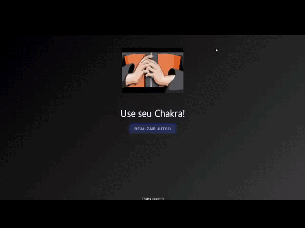

<h1 align="center">Desafio 1 ASCII</h1>

> Este é meu desafio 1 feito para ASCII <a href="https://desafioascii.netlify.app/">Visite a página</a>  
> Caso quiser dar uma olhada no meu linkedin e se interessar <a href="https://www.linkedin.com/in/lauraaloboo/">Linkedin</a>

  

 <h3 align="center">Tecnologias utilizadas:</h3>
 

 

[⬆ Volte para o topo!](https://github.com/LauraLobo) 
